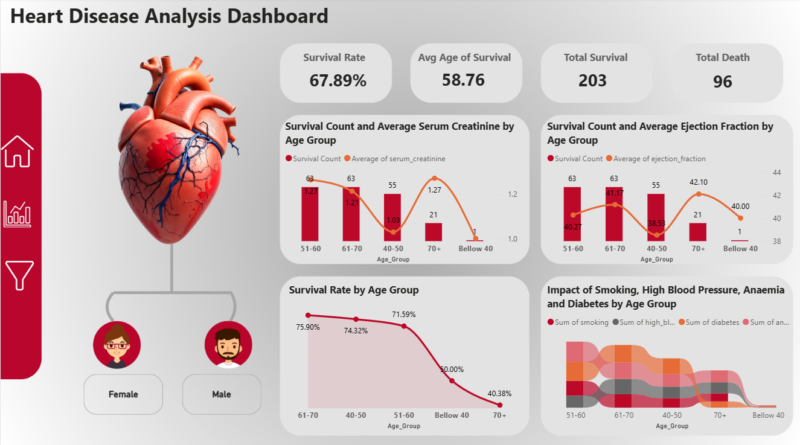

🫀 Heart Disease Analysis Dashboard (Power BI)

📘 Project Overview
This project visualizes heart disease data using **Power BI**, providing insights into patient survival rates, age distribution, and the effects of various health factors like smoking, anaemia, high blood pressure, and diabetes.

📊 Dashboard Highlights
- **Overall Survival Rate:** 67.89%
- **Average Age of Survival:** 58.76 years
- **Total Survivors:** 203 | **Total Deaths:** 96
- **Key Visuals:**
  - Survival by Age Group
  - Serum Creatinine vs Survival Count
  - Ejection Fraction Trends
  - Impact of Smoking & Other Conditions

🧠 Tools & Skills Used
- Power BI  
- DAX Functions  
- Data Cleaning & Transformation  
- Data Visualization & Dashboard Design  
- Statistical Analysis  

⚙️ Project Workflow
1. Loaded and cleaned the dataset in **Power Query**  
2. Created **calculated measures** for survival analysis  
3. Designed visuals for different patient groups  
4. Added interactivity and navigation menus  
5. Built the final dashboard view  

🖼 Dashboard Preview

📁 Files Included
| File | Description |
|------|--------------|
| `Heart_Disease_Analysis_Dashboard.pbix` | Power BI project file |
| `Dashboard_Screenshot.png` | Dashboard preview image |
| `heart_disease.csv` | Dataset used for analysis *(if shared)* |

🚀 How to View
1. Download the `.pbix` file  
2. Open it using **Power BI Desktop**  
3. Explore the visuals and insights interactively  

 🩺 Key Insights
- Survival rate decreases significantly after age 60  
- High serum creatinine and low ejection fraction link with lower survival  
- Lifestyle factors (smoking, diabetes, anaemia) impact patient outcomes  

🔗 Connect with Me
💼 [LinkedIn](https://www.linkedin.com/in/gaurav-kakde-57235b312/)  
📧 kakdegaurav876@email.com  

⭐ **If you like this project, don’t forget to star the repo!**
